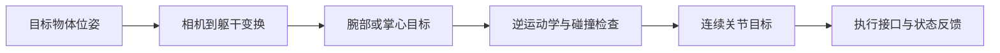

# 手臂控制与逆运动学

从 SDK 状态读取到抓取任务，中间还需要关节映射、坐标变换、逆运动学和轨迹执行。本页提供可在 CPU 上运行的 G1 29-DoF 固定基座实验：先求一个腕部目标位姿，再通过 MuJoCo 动力学跟踪。实验不包含 BrainCo2 手模型，不向实机发送命令。

## 环境与模型

在开发电脑使用 Python 3.10 或更新版本，建立与 SDK 分开的环境。以下依赖组合在 Python 3.12 上完成本地检查：

```bash
cd ~/unitree-g1-handbook
python3 -m venv .venv-examples
source .venv-examples/bin/activate
python -m pip install -r examples/requirements-sim.txt
git clone https://github.com/unitreerobotics/unitree_mujoco.git ~/unitree_mujoco_lab
git -C ~/unitree_mujoco_lab checkout --detach 1eb6642e3f3fdfb7fb13a9794fd6a2dd93ea0e7d
python examples/arm_lab.py ik \
  --model ~/unitree_mujoco_lab/unitree_robots/g1/g1_29dof.xml \
  --output /tmp/g1-ik-run
```

固定模型来源：[G1 29-DoF XML](https://github.com/unitreerobotics/unitree_mujoco/blob/1eb6642e3f3fdfb7fb13a9794fd6a2dd93ea0e7d/unitree_robots/g1/g1_29dof.xml)。脚本在内存中移除浮动基座关节；原始模型文件保持原样。输出目录保存 `ik.json`，重复运行会覆盖同名结果，请为不同实验使用不同目录。

## 示例做了什么

1. 按关节名称找到左臂 7 个关节及对应 `qpos`、速度地址，不假定数组连续偏移。
2. 从一个小幅变化的已知姿态生成可达腕部位姿，保存世界系位置与 `w,x,y,z` 四元数。
3. 用位置和姿态误差、6×7 雅可比及阻尼最小二乘求解；每步限幅，并裁剪到模型关节范围。
4. 从初始关节角通过三次平滑插值过渡到解，在动力学循环中用 PD 与模型偏置力补偿跟踪。
5. 输出运动学残差及执行后的最大关节误差。

运动学阶段调用 `mj_forward`，跟踪阶段调用 `mj_step`，两者不能混为“机器人已经执行成功”。API 含义见 [MuJoCo 计算流程](https://mujoco.readthedocs.io/en/3.3.7/computation/index.html)与[雅可比接口](https://mujoco.readthedocs.io/en/3.3.7/APIreference/APIfunctions.html#mj-jacbody)。

本地一次运行得到的位置残差约 `5.75e-5 m`、姿态残差约 `4.46e-6 rad`，动力学跟踪最大关节误差约 `2.61e-4 rad`。完整数据见[验证记录](../hardware/validated-configurations.md)。这些数字仅对应脚本默认目标、固定基座和该模型。

## 位姿、关节目标与力矩



示例目标是 `left_wrist_yaw_link` 原点，不是手掌中心或指尖。安装 BrainCo2 后，要测量腕部到手掌的固定变换，将手的几何、质量和惯量加入模型。现有假手模型不能代表真实抓取接触。

正向运动学为 `T_world_palm = T_world_wrist × T_wrist_palm`；给定掌心目标时，先右乘 `inverse(T_wrist_palm)` 得到腕部目标。相机定位还需 `T_world_camera`，详见[传感器页](../hardware/sensors.md)。关节限位以模型数据为起点，实机有效范围另行核对。

## 碰撞与不可达目标

本示例的 IK 没有碰撞约束，也没有对接触作成功判据；动力学模型中的碰撞几何不等于规划器已经避障。将目标改成真实桌面任务之前，需要沿整段插值轨迹检查手臂、手掌、躯干与桌面间距，并验证末端朝向和载荷。

目标超出工作空间、雅可比接近奇异、关节卡在限位或迭代不收敛时，应报告失败并保留上一条有效目标。不要把最后一次迭代值无条件交给执行器。实机应用还需检查观测超时、速度/加速度、接管和退出行为。

## 实机控制权如何交接

| 接口 | 作用 | 本页的边界 |
| --- | --- | --- |
| `rt/arm_sdk` | 官方运控体系中的手臂目标接口 | 按固件和 SDK 文档确认支持模式 |
| `rt/lowcmd` | 底层机体控制 | 涉及全身控制权，不能只改话题名替代 arm_sdk |
| BrainCo 命令话题 | 独立手指目标 | 单位与机身关节不同，见[BrainCo2](brainco2.md) |

固定版本的 [arm7 示例](https://github.com/unitreerobotics/unitree_sdk2_python/blob/814556d15970dd2ecf1c9984e845ca02ab07e206/example/g1/high_level/g1_arm7_sdk_dds_example.py)用 `motor_cmd[29].q` 表示 arm_sdk 权重；槽位 29 不是机身第 30 个关节。示例包含归零、抬臂、回位和权重释放，运行会产生动作，不是通信检查。

实机工程应先从当前测量姿态建立连续目标，确认接管后再运动；正常结束时回到约定姿态并按对应接口释放权重。`Ctrl+C`、网络断开与权重释放不是同一过程。该过程必须在设备对应的支撑、模式和固件下验证，本页的离线脚本不能充当实机控制器。

继续阅读：[遥操作](teleoperation.md) · [学习实验](../learning/first-policy.md)
