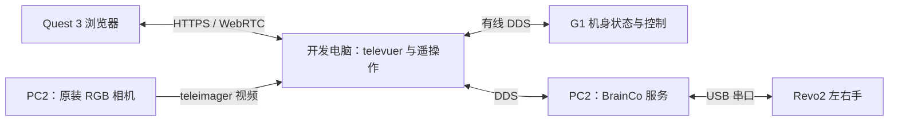

# Quest 3 遥操作：G1 EDU 与 BrainCo2

本页按实验室配置组织：G1 EDU 29-DoF、BrainCo2（Revo2）双手、原装相机与 Meta Quest 3。目标是建立视频与跟踪链路，完成空载动作和一条演示录制。以下是固定上游版本的操作指南，尚未在本实验室硬件完成联调。

## 主机与链路



Quest 3 与开发电脑处于可互通的实验室局域网；电脑到 G1 保持有线连接。Quest 3 的视频链路和机器人的 DDS 网卡是不同配置。示例中的 `192.168.123.164` 是 PC2 地址，`enp3s0` 是电脑网卡，均按实际环境替换。

## 固定依赖

在开发电脑新建环境，不在机器人已有运控环境直接升级：

```bash
git clone https://github.com/unitreerobotics/xr_teleoperate.git ~/xr_teleoperate_lab
cd ~/xr_teleoperate_lab
git checkout --detach 817fb00c63cde15e5f24a0f8fa08e1e33ed89d3b
git submodule update --init --recursive
conda create -n g1-teleop python=3.10 pinocchio=3.1.0 numpy=1.26.4 -c conda-forge
conda activate g1-teleop
python -m pip install -e teleop/teleimager --no-deps
python -m pip install -e teleop/televuer
python -m pip install -e teleop/robot_control/dex-retargeting
python -m pip install -r requirements.txt
python -m pip install -e ~/unitree_sdk2_python
git submodule status --recursive
```

Python SDK 使用[版本表](../hardware/validated-configurations.md)中的提交。安装流程依据[固定版本说明](https://github.com/unitreerobotics/xr_teleoperate/blob/817fb00c63cde15e5f24a0f8fa08e1e33ed89d3b/README_zh-CN.md)。对应 teleimager 子模块为 `57cf2a4`，它使用 `cam_config_server.yaml`；不要混用后来更改配置目录的版本教程。

## 先完成视频与 Quest 跟踪

在 PC2 按[传感器页](../hardware/sensors.md#stock-camera)确认原装相机。该上游设备说明使用内置 RealSense D435i；实机未确认前不要把型号写入验收记录。此处只使用 RGB 视角，不假定安装了腕部相机。

在 PC2 的独立相机环境安装相同 teleimager 提交及 `.[server]` 依赖。发现设备：

```bash
cd ~/xr_teleoperate_lab/teleop/teleimager
python -m teleimager.image_server --cf --rs
```

配置 `cam_config_server.yaml` 的头部相机为 `type: realsense`、`binocular: false`，填入实际序列号和设备支持的分辨率/帧率。左右腕相机的 `enable_zmq` 和 `enable_webrtc` 均设为 `false`。仓库提供[单相机参考配置](https://github.com/yfrobotics/unitree-g1-handbook/blob/main/examples/config/teleimager-stock-rgb.yaml)，替换序列号后再用于对应版本。

按上游 [Quest/Pico HTTPS 步骤](https://github.com/unitreerobotics/xr_teleoperate/blob/817fb00c63cde15e5f24a0f8fa08e1e33ed89d3b/README_zh-CN.md)在开发电脑的 `teleop/televuer` 目录生成证书；证书中应包含实际访问的主机地址。相机服务需要相应的证书配置。仅在受控局域网核验设备身份后接受本地证书，勿将服务直接暴露到公网。

在 PC2 启动图像服务：

```bash
python -m teleimager.image_server --rs
```

用 Quest 3 浏览器访问相机服务 `https://PC2地址:60001`，确认预览不是冻结帧。之后按固定版本文档进入开发电脑的 Vuer 页面并启用 VR 会话。两台电脑可能有不同证书；相机页面成功不等于 XR 跟踪已建立。

## 启动前的配置验收

| 项目 | 验收方法 |
| --- | --- |
| 机身 | [只读程序](first-program.md)能持续读取正确的 29-DoF 状态 |
| 双手 | [BrainCo2 服务](brainco2.md)左右状态各 6 通道且身份正确 |
| 图像 | 实际移动物体，检查画面持续更新；单目图像未被错误切成左右两半 |
| 跟踪 | Quest 中左右手/手柄方向正确，重新居中后参考姿态一致 |
| 坐标 | 先用离线模型确认向前/向上/向外与腕部目标方向一致 |
| 模式 | 现场负责人确认调试模式、可靠支撑与退出回位过程 |

跟踪丢失、画面冻结、网络断开时的动作保持和停止行为必须实测；不能把 `q` 键或 Quest 退出 VR 当成通用急停。服务初始化可能已经建立命令线程，未按 `r` 也不意味着程序只读。

## 实机空载遥操作与录制

以下命令会控制机身与手部，只有上表完成、支撑与停止流程明确后执行。在开发电脑：

```bash
conda activate g1-teleop
cd ~/xr_teleoperate_lab/teleop
python teleop_hand_and_arm.py \
  --arm G1_29 --ee brainco --input-mode hand \
  --network-interface enp3s0 --img-server-ip 192.168.123.164 \
  --frequency 30 --record \
  --task-dir "$HOME/datasets/g1_raw/reach_open_hand" \
  --task-name reach_open_hand \
  --task-goal 'Move the open left hand to the marked position and return.'
```

初次选择空载伸手任务，不直接抓取物体。`--input-mode controller` 可选择 Quest 手柄输入，但手指映射与手势模式不同，需另行验收。不加 `--motion` 的流程涉及调试控制，必须落实支撑；不要把该示例当作自主站立模式。

| 操作 | 固定版本行为 |
| --- | --- |
| `r` | 开始遥操作 |
| `s` | 开始录制，再按一次结束当前 episode 并保存 |
| `q` | 正常退出；退出流程可能驱动双臂回到初始姿态 |

先回到适当的初始姿态附近，停止录制并等待保存完成，再正常退出。正常退出不等于断电；手部服务也可能仍在运行。保留终端日志及实际退出行为，见[数据采集](../learning/data-collection.md)。

## 仿真支持边界

`--sim` 在此版本切换到 DDS 域 `1`；还应明确使用隔离网卡，单机可设 `--network-interface lo`。官方教程提供 G1_29 + Dex3 的 Isaac Lab 场景，但本次核对没有找到等价的 BrainCo2 任务。不能只把 `--ee dex3` 改为 `brainco` 就宣称仿真支持该硬件。

可先完成[固定基座手臂实验](arm-control.md)，再为 Revo2 补充模型、6 通道驱动映射和相机配置。Dex3 场景可用于学习工具流程，但其演示和策略不能直接用于本实验室双手。
