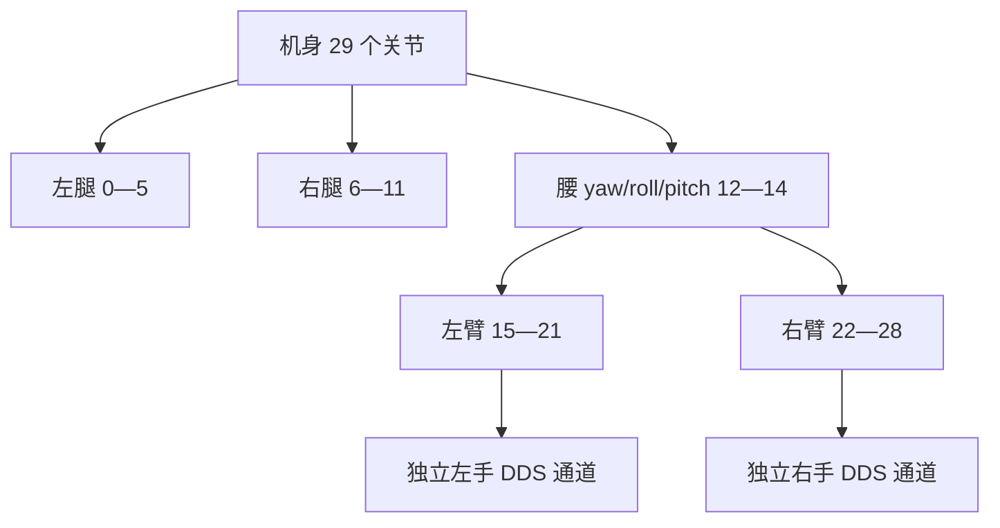

# 关节映射与坐标系

实验室使用 G1 EDU 29-DoF。控制消息槽位、模型关节 ID、广义坐标地址与学习动作维度是四种不同的编号。本页提供固定版本的机身映射，以及 23-DoF 资料差异的处理方法；手部通道另见 [BrainCo2](../development/brainco2.md)。

## 机身分组



左右以机器人自身为准。头部不是该机身表中的可控颈关节。BrainCo2 每手 6 个归一化通道，不能按机身弧度指令解释。

## 29-DoF 对照表

机身 SDK 槽位依据 [arm7 示例](https://github.com/unitreerobotics/unitree_sdk2_python/blob/814556d15970dd2ecf1c9984e845ca02ab07e206/example/g1/high_level/g1_arm7_sdk_dds_example.py)，模型名、轴与范围依据 [MuJoCo XML](https://github.com/unitreerobotics/unitree_mujoco/blob/1eb6642e3f3fdfb7fb13a9794fd6a2dd93ea0e7d/unitree_robots/g1/g1_29dof.xml)。轴在各关节局部坐标系表达，正向绕该轴遵循右手规则，不能直接把所有局部轴当作世界轴。

| DDS 槽位 | 模型关节名 | 局部轴 | 模型范围 rad |
| --- | --- | --- | --- |
| 0 | `left_hip_pitch_joint` | (0,1,0) | -2.5307 至 2.8798 |
| 1 | `left_hip_roll_joint` | (1,0,0) | -0.5236 至 2.9671 |
| 2 | `left_hip_yaw_joint` | (0,0,1) | -2.7576 至 2.7576 |
| 3 | `left_knee_joint` | (0,1,0) | -0.0873 至 2.8798 |
| 4 | `left_ankle_pitch_joint` | (0,1,0) | -0.8727 至 0.5236 |
| 5 | `left_ankle_roll_joint` | (1,0,0) | -0.2618 至 0.2618 |
| 6 | `right_hip_pitch_joint` | (0,1,0) | -2.5307 至 2.8798 |
| 7 | `right_hip_roll_joint` | (1,0,0) | -2.9671 至 0.5236 |
| 8 | `right_hip_yaw_joint` | (0,0,1) | -2.7576 至 2.7576 |
| 9 | `right_knee_joint` | (0,1,0) | -0.0873 至 2.8798 |
| 10 | `right_ankle_pitch_joint` | (0,1,0) | -0.8727 至 0.5236 |
| 11 | `right_ankle_roll_joint` | (1,0,0) | -0.2618 至 0.2618 |
| 12 | `waist_yaw_joint` | (0,0,1) | -2.6180 至 2.6180 |
| 13 | `waist_roll_joint` | (1,0,0) | -0.5200 至 0.5200 |
| 14 | `waist_pitch_joint` | (0,1,0) | -0.5200 至 0.5200 |
| 15 | `left_shoulder_pitch_joint` | (0,1,0) | -3.0892 至 2.6704 |
| 16 | `left_shoulder_roll_joint` | (1,0,0) | -1.5882 至 2.2515 |
| 17 | `left_shoulder_yaw_joint` | (0,0,1) | -2.6180 至 2.6180 |
| 18 | `left_elbow_joint` | (0,1,0) | -1.0472 至 2.0944 |
| 19 | `left_wrist_roll_joint` | (1,0,0) | -1.9722 至 1.9722 |
| 20 | `left_wrist_pitch_joint` | (0,1,0) | -1.6144 至 1.6144 |
| 21 | `left_wrist_yaw_joint` | (0,0,1) | -1.6144 至 1.6144 |
| 22 | `right_shoulder_pitch_joint` | (0,1,0) | -3.0892 至 2.6704 |
| 23 | `right_shoulder_roll_joint` | (1,0,0) | -2.2515 至 1.5882 |
| 24 | `right_shoulder_yaw_joint` | (0,0,1) | -2.6180 至 2.6180 |
| 25 | `right_elbow_joint` | (0,1,0) | -1.0472 至 2.0944 |
| 26 | `right_wrist_roll_joint` | (1,0,0) | -1.9722 至 1.9722 |
| 27 | `right_wrist_pitch_joint` | (0,1,0) | -1.6144 至 1.6144 |
| 28 | `right_wrist_yaw_joint` | (0,0,1) | -1.6144 至 1.6144 |

范围是模型限制，不是带载实机的安全工作范围。踝/腰的并联机构在 PR 与 AB 模式中的语义不同；必须同时核对控制模式，不能只对齐索引。

## 23-DoF 不能简单压缩数组

官方仓库中的 [23-DoF 索引说明](https://github.com/unitreerobotics/unitree_mujoco/blob/1eb6642e3f3fdfb7fb13a9794fd6a2dd93ea0e7d/unitree_robots/g1/g1_joint_index_dds.md)列出紧凑顺序：腰后左臂 13—17、右臂 18—22。但固定 Python SDK 的 [arm5 示例](https://github.com/unitreerobotics/unitree_sdk2_python/blob/814556d15970dd2ecf1c9984e845ca02ab07e206/example/g1/high_level/g1_arm5_sdk_dds_example.py)仍使用左臂 15—19、右臂 22—26，并把额外腰/腕槽位标为无效。

而该 MuJoCo 提交的 `g1_23dof.xml` 还含额外占位关节，执行器排列需从模型读取。**紧凑文档表不是此处模型执行器数组或实机固件的通用映射。** 按“固件消息定义 + 使用的示例 + 实际模型”建立独立映射，先只读核对；不要给未知槽位发试探命令。

| 部位 | 29-DoF SDK | 23-DoF arm5 示例 | 23-DoF 文档紧凑表 |
| --- | --- | --- | --- |
| 双腿 | 0—11 | 0—11 | 0—11 |
| 腰 yaw | 12 | 12 | 12 |
| 腰 roll/pitch | 13、14 | 标记无效 | 不列出 |
| 左肩/肘/腕 roll | 15—19 | 15—19 | 13—17 |
| 左腕 pitch/yaw | 20、21 | 标记无效 | 不列出 |
| 右肩/肘/腕 roll | 22—26 | 22—26 | 18—22 |
| 右腕 pitch/yaw | 27、28 | 标记无效 | 不列出 |

## 导出实际模型地址

在[仿真示例环境](../development/arm-control.md)执行：

```bash
python examples/inspect_model.py \
  ~/unitree_mujoco_lab/unitree_robots/g1/g1_29dof.xml > /tmp/g1-model-map.csv
```

下载本次生成的 [CSV](../_static/validation/g1-29-model-map.csv)。浮动基座占用 7 个位置坐标、6 个速度坐标，因此 `qpos` 和速度地址不相同；固定基座后的地址又会变化。按关节名称查地址，不把 DDS 索引直接作为 `qpos` 索引。

## 坐标与旋转约定

本手册示意采用机身前方 x、左方 y、上方 z 的右手系，实际轴以模型和传感器驱动为准。ROS 相机 optical frame 与机身轴通常不同，见[传感器标定](sensors.md)。SDK/MuJoCo 四元数示例为 `w,x,y,z`，ROS 消息字段常按 `x,y,z,w` 命名；转换时按字段赋值，而非原样复制四元素数组。

用一个静止姿态和一组已知旋转做离线检验：旋转矩阵应正交且行列式接近 1，变换与逆变换应还原原坐标。欧拉角必须同时注明轴序、内禀/外禀约定和单位。正方向最终通过模型的小幅变化和现场只读状态确认。
