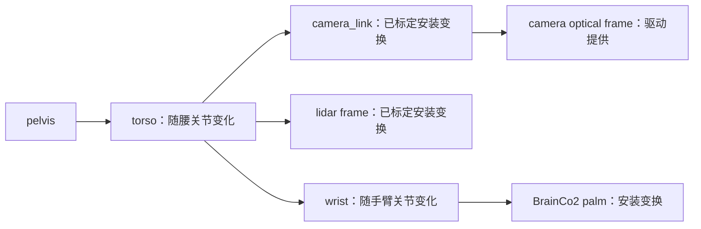

# 传感器与感知

感知开发应先回答三个问题：数据来自哪个设备、坐标和单位是什么、时间是否对应当前时刻。接收到消息后，再考虑可视化、建图或抓取算法。

## 数据来源

| 数据 | 常见用途 | 首次检查 |
| --- | --- | --- |
| 关节状态 | 姿态、运动学、执行器诊断 | 编号、角度单位、更新时间和有效关节范围 |
| IMU | 姿态与惯性观测 | 坐标轴、四元数顺序、角速度和加速度含义 |
| 深度相机 | 近距离几何、目标定位 | 实际型号、深度单位、标定和图像配准 |
| 3D 激光雷达 | 空间测量、点云、定位建图 | 点云坐标系、时间戳、视场和发布服务 |
| 手部触觉或压力 | 抓取接触判断 | 是否安装、数据有效性和标定方式 |

G1 公开配置包含深度相机和 3D 激光雷达，具体设备型号、驱动和开放方式仍需按实机确认。[官方产品配置](https://www.unitree.com/g1/)

## 先读取关节与 IMU

完成 [ROS2 集成](../development/ros2.md)后，先查看消息定义和当前话题：

```bash
ros2 interface show unitree_hg/msg/LowState
ros2 interface show unitree_hg/msg/IMUState
ros2 interface show unitree_hg/msg/MotorState
ros2 topic list -t
```

`LowState` 中的 `imu_state` 与 `motor_state` 提供基础机体状态。IMU 定义包含四元数、角速度、加速度、欧拉角和温度字段；不要假定它已经等同于标准 ROS2 的 `sensor_msgs/msg/Imu`。[IMU 消息定义](https://github.com/unitreerobotics/unitree_ros2/blob/master/cyclonedds_ws/src/unitree/unitree_hg/msg/IMUState.msg)

官方状态示例将四元数按 `w, x, y, z` 输出，关节 `q` 和 `dq` 分别按弧度和弧度每秒解释。转换到其他库时显式检查分量顺序和单位。[官方状态读取示例](https://github.com/unitreerobotics/unitree_ros2/blob/master/example/src/src/read_low_state_hg.cpp)

`MotorState` 还定义了估计力矩、温度、电压及状态字段。估计力矩不能直接当作经过标定的接触力；数组中预留或未安装关节的数据也不能作为有效测量。[MotorState 定义](https://github.com/unitreerobotics/unitree_ros2/blob/master/cyclonedds_ws/src/unitree/unitree_hg/msg/MotorState.msg)

## 找到相机和激光雷达数据

先在机器人开发计算单元上检查已部署服务和交付文档，再确认传感器数据是以 ROS2、DDS、视频流还是设备驱动接口提供。安装 SDK 本身不保证相机和点云话题自动出现。

如果数据通过 ROS2 发布，使用以下方法查找类型，不预设固定话题名：

```bash
ros2 topic list -t
```

寻找图像、相机标定或点云对应的消息类型，再对实际话题执行 `ros2 topic info 话题名 --verbose`。如果没有任何相关话题，应先确认驱动或数据服务是否启动，以及它是否运行在另一台计算单元或另一个 ROS 环境中。

图像先检查分辨率、编码、帧率和曝光，再检查彩色与深度是否对齐。点云先看时间戳、`frame_id` 和数值范围，再判断是否需要裁剪或滤波。不要通过反复启动多个驱动实例解决设备占用问题。

## 坐标系与标定

下面是本手册建议的数据验收方法：

1. 画出相机、雷达、躯干、手臂基座和末端之间的坐标关系，记录每个变换的来源。
2. 用实际测量或标定结果确定传感器外参，不用猜测的安装角度代替。
3. 在可视化工具中查看地面、墙面和机器人结构，检查上下、前后和左右方向。
4. 将已知距离的静态物体与深度或点云测量比较，先验证单位再调算法。
5. 移动手臂或机身后检查变换链是否随关节状态更新，避免把动态关系写成静态变换。

在 RViz 中出现点云倾斜或图像定位偏移时，优先查坐标和时间，而不是立即调整控制增益。

## 时间同步与记录

区分设备采样时间、驱动发布时间和电脑接收时间。跨计算单元采集时，先检查各主机时钟与同步方式，再比较不同传感器；`LowState` 的 `tick` 不应未经确认就解释为 Unix 时间戳。

建议先记录短时静态场景，检查消息数、频率、时间是否单调和是否掉帧，再扩大录制规模。图像与点云的数据量较大，先用 `df -h` 检查磁盘余量。

录包方法和回放注意事项见 [ROS2 页面](../development/ros2.md)。记录模型版本、相机内外参、采样配置和环境信息，才能让离线结果与实机实验对应。

## 从感知到动作

感知输出进入抓取或导航控制前，应检查置信度、数据新鲜度、坐标变换和目标可达性。先在静态数据上验证，再用[仿真](../development/simulation.md)测试闭环流程；传感器暂时失效时应有明确的停止或等待行为。

遇到无数据、频率异常或坐标错误，继续阅读[故障排查](../troubleshooting.md)。

## 实验室原装相机：先确认型号 {#stock-camera}

设备负责人确认使用原装相机与雷达，尚未提供型号与固件记录。固定版本的宇树 [teleop 设备清单](https://github.com/unitreerobotics/xr_teleoperate/blob/817fb00c63cde15e5f24a0f8fa08e1e33ed89d3b/Device_zh-CN.md)列出内置 RealSense D435i，因此下面给出**确认是该系列设备后**的操作分支；不假定有额外腕部相机。

在 PC2 执行只读发现：

```bash
lsusb
ls -l /dev/v4l/by-id/
v4l2-ctl --list-devices
rs-enumerate-devices
```

后两个命令分别来自 `v4l-utils` 与已安装的 librealsense 工具；没有工具时先查现有驱动部署，不因此重装整套系统。记录设备序列号、固件、USB 连接速度、可用分辨率和当前占用进程。已有图像服务运行时先使用其输出，不同时开第二个驱动。

### ROS2 RGB-D 路线

在已安装匹配 RealSense ROS2 驱动的 PC2 上，确认相机没有被 teleimager 占用，再启动：

```bash
source /opt/ros/humble/setup.bash
ros2 launch realsense2_camera rs_launch.py \
  enable_color:=true enable_depth:=true \
  align_depth.enable:=true pointcloud.enable:=true
```

参数来自 [RealSense 官方 ROS2 驱动](https://github.com/realsenseai/realsense-ros)。默认命名空间通常为 `/camera/camera`，仍用 `ros2 topic list -t` 核对。本实验室未验证驱动/JetPack 组合，安装应采用对应发行版的官方方式并记录包版本。

```bash
ros2 topic echo /camera/camera/color/camera_info --once
ros2 topic hz /camera/camera/color/image_raw
ros2 topic hz /camera/camera/aligned_depth_to_color/image_raw
```

预期彩色图像、标定和对齐深度持续更新。不要把“深度对齐到 RGB”当作相机到机器人外参已经标定。`16UC1`、`32FC1` 和原始 SDK 深度尺度要按驱动定义处理，先用已知距离的物体核验。

### Quest 3 视频路线

遥操作采用[固定 teleimager 版本](../development/teleoperation.md)，启用单 RGB 头部视角，关闭不存在的腕部相机。RGB 的单目显示与深度设备的双目测距是不同概念；不要因 D435i 是深度相机就设置 `binocular: true`，那会把一幅 RGB 图分成两幅。

本手册提供 [teleimager-stock-rgb.yaml](https://github.com/yfrobotics/unitree-g1-handbook/blob/main/examples/config/teleimager-stock-rgb.yaml)。其中序列号必须替换，640×480@30 是参考请求，需以设备实际支持模式为准。使用该路线采集的数据配置见[演示转换](../learning/data-collection.md)。

## 原装雷达的条件式接入

公开 G1 配置只说明 3D 激光雷达，不能据此固定所有批次为同一型号。先从铭牌、交付清单、当前服务和点云消息中确认型号、网络归属及数据开放方式。可执行：

```bash
systemctl list-units --type=service | rg -i 'lidar|livox|unitree'
ros2 topic list -t
ip -br addr
```

如果已有 `sensor_msgs/msg/PointCloud2`，先订阅现有服务；不要为安装驱动更改机器人内部控制网段。只有确认是 Livox MID-360/HAP 且允许用户直接访问时，才按 [Livox ROS Driver 2](https://github.com/Livox-SDK/livox_ros_driver2)配置设备/主机地址并选择其 ROS2 launch 文件。其他型号使用各自厂商驱动，不能套用 Livox 的端口或包格式。

点云数据验收记录实际话题、类型、`frame_id`、每秒点数和时间单位。自定义 Livox 消息与 `PointCloud2` 不可直接互换；需要选择发布类型或显式转换，再接入下游算法。

## RViz、外参与同步的实操验收

在开发电脑启动 `rviz2`，先把 Fixed Frame 设置为实际传感器 frame，添加 Image 或 PointCloud2。确认数据自身正确后再切换到机身坐标系，并添加 TF 显示。设置使用实际话题和与发布端兼容的 QoS，保存为实验目录中的 `.rviz` 文件。



这是期望的变换关系示意，实际父节点与 frame 名称按安装位置和模型确认。采用驱动提供的 optical 变换；ROS optical frame 通常 x 向右、y 向下、z 向前，见 [REP-103](https://www.ros.org/reps/rep-0103.html)。不要用一个全零静态变换让 RViz 消除报错。

先保存内参 `CameraInfo`，用覆盖画面中心/边缘、不同距离和角度的标定板图像检查重投影误差。外参标定用相机观测与机器人/标定板姿态建立对应，保留采样姿态、单位和求解残差。相机重装或手部安装变动后重新验证对应变换。独立测量点应能从相机系投到机身系，且移动腰/臂后仍一致。

跨主机先查看 `timedatectl` 和已有时间同步服务状态，再比较采样/发布/接收时间。记录短段静止与缓慢运动场景，检查时间单调性、帧间隔、图像与关节变化的相对延迟；平均频率正确也可能有突发丢帧。不要只靠把所有 header 改成“当前时间”掩盖错位。

现场完成后，把型号、驱动版本、标定文件、RViz 配置、短录包和数值结果填入[配置验证表](validated-configurations.md)。
