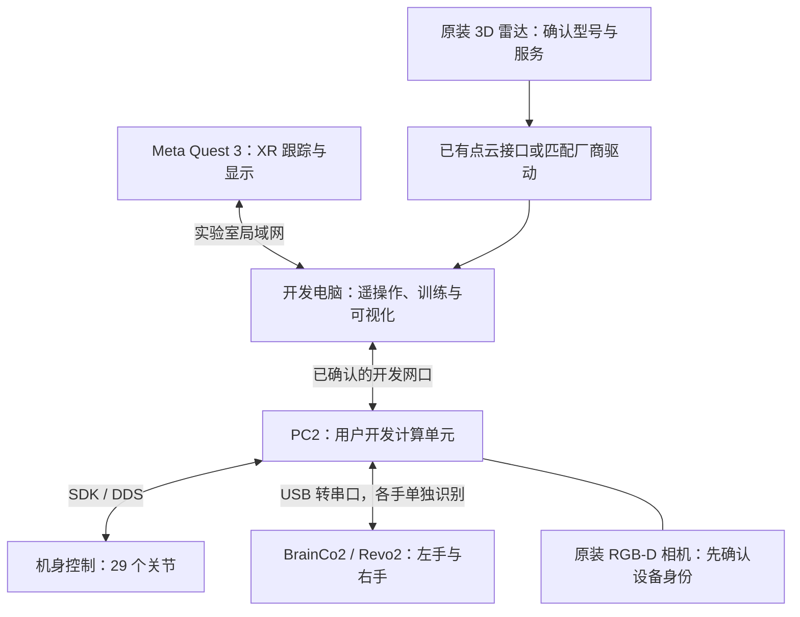
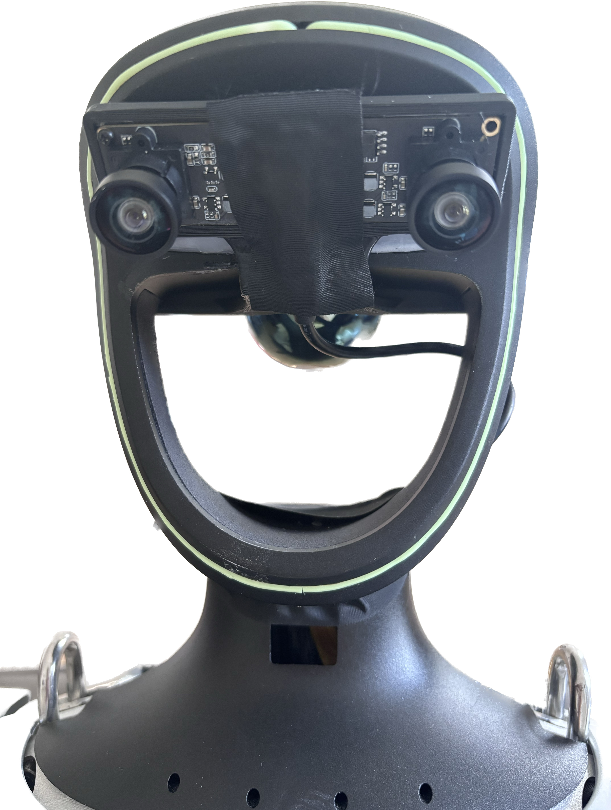

# 硬件识别与拍照记录

本页帮助把实物、接口和软件配置对应起来。实验室目标为 G1 EDU 29-DoF、BrainCo2 双手与原装传感器；目前没有本实验室设备照片，因此不把其他配置的照片标成实机安装说明，也不凭外壳位置推断内部端口。

## 配置与接口示意

此图表示功能关系，不表示针脚、电压、实际端口数量或允许自行拆接。开发电脑的网卡名与 PC2 的网卡名可能不同；控制计算单元也不等同于用户开发计算单元。

## 官方照片对照：额外相机不等于原装

{ width="420" }

图中可见上方带两个镜头的外置相机板、中央固定带以及下方线缆。它用于说明上游遥操作示例可能增加额外相机，**不是本实验室原装相机的验收照片**。相机板的双目图像布局不能直接套到原装 RGB 流。照片未修改，来源为 [xr_teleoperate 固定提交](https://github.com/unitreerobotics/xr_teleoperate/blob/817fb00c63cde15e5f24a0f8fa08e1e33ed89d3b/img/real_head.jpg)，保留[版权说明](../_static/hardware/NOTICE.txt)与[许可证](../_static/hardware/xr-teleoperate-LICENSE.txt)。

## 实机照片应如何标注

| 照片 | 必须标注 | 与文档的连接 |
| --- | --- | --- |
| 机身正面与背面 | 机型、左右方向、拍摄日期、手型与附加设备 | [规格](specs.md)、[关节分组](joint-mapping.md) |
| 开发接口近照 | 交付资料中的端口编号、连接目标、线缆用途 | [网络](../networking/connect-to-robot.md) |
| PC2 信息与连接 | 开发计算单元型号、用户可访问接口 | [配置表](validated-configurations.md) |
| 左右手及接口 | BrainCo2 铭牌、左右序列号对应关系、活动余量 | [手部服务](../development/brainco2.md) |
| 相机/雷达窗口与铭牌 | 型号、遮挡情况、安装相对位置 | [传感器](sensors.md) |

照片由设备负责人在停止且稳定支撑的状态下采集，不为拍照拆开带电结构。公开版本隐藏序列号等内部识别信息；实验室原始记录保留完整对应关系。照片补齐后，按实际端口资料绘制箭头和编号，并附未修改原图及出处。

照片不能替代标定：相机外参、手掌安装变换与载荷参数仍需测量。几何模型里的局部坐标轴见[关节映射](joint-mapping.md)。
