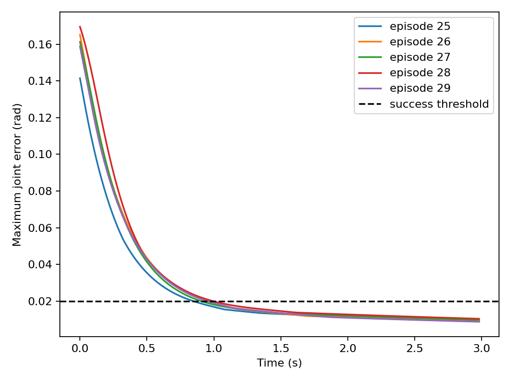

# 第一个学习实验：从示范到闭环评测

本页先完成一个可在 CPU 上复现的固定基座 G1 左臂到达实验，再说明如何进入实验室 BrainCo2 + 单 RGB 相机的 ACT 训练。第一部分使用合成专家示范和线性行为克隆，不是 VLA，也没有学习抓取或行走。

## 实验定义

任务是从固定起始姿态到达一个 7 维左臂关节目标。观测为 `目标关节角 − 当前关节角`，动作为下一次关节目标的增量，单位均为 rad。物理步长为 0.002 秒，每 10 步更新一次动作，即 50 Hz；其余机身关节保持初始目标，基座固定。

专家为带限幅的比例到达规则，收集 30 条、每条 100 帧的轨迹。前 20 条训练、5 条验证、5 条测试；一条轨迹的所有帧只属于一个集合。目标在初始姿态附近随机采样，随机种子为 7。

成功判据提前固定：闭环运行 150 步后，7 个关节的最大绝对误差小于 0.02 rad。判据只衡量关节到达，不衡量接触、避障、末端抓取或平衡。

## 采集、训练、恢复与评测

先按[手臂实验](../development/arm-control.md)安装 `examples/requirements-sim.txt` 并下载固定模型。所有命令在本手册仓库根目录执行：

```bash
source .venv-examples/bin/activate
python examples/arm_lab.py collect \
  --model ~/unitree_mujoco_lab/unitree_robots/g1/g1_29dof.xml \
  --output /tmp/g1-first-policy --seed 7
python examples/arm_lab.py train --output /tmp/g1-first-policy
python examples/arm_lab.py evaluate \
  --model ~/unitree_mujoco_lab/unitree_robots/g1/g1_29dof.xml \
  --output /tmp/g1-first-policy
```

脚本不导入 SDK，也不建立 DDS 连接。运行结果写入指定目录，重复运行会覆盖同名产物；更换种子或模型时使用新目录。

| 产物 | 内容与检查 |
| --- | --- |
| `demonstrations.npz` | 观测、动作、episode、划分和目标；使用 `allow_pickle=False` 读取 |
| `collect.json` | 关节名、单位对应的流程、种子、模型文件 SHA-256、依赖版本 |
| `policy.npz` | 线性权重及仅由训练集计算的均值/尺度 |
| `train.json` | 验证集动作均方误差 |
| `evaluate.json` | 从磁盘恢复模型后的测试成功数和最终误差 |
| `rollout.csv` / `rollout.png` | 闭环误差时间曲线，便于检查振荡或停滞 |

训练前会检查数值有限、动作和观测维度一致、episode 没有跨集合。评测重新读取 `policy.npz`，使用物理积分得到下一时刻状态，不把专家状态直接送给模型充当闭环。

## 本地结果及其含义

2026-09-26 在 x86_64、Python 3.12、NumPy 2.2.6、MuJoCo 3.3.7 上，默认种子得到验证集动作 MSE 约 `2.69e-7`，五条测试轨迹均满足 0.02 rad 判据，最终最大关节误差约为 `0.0088—0.0104 rad`。原始结果可下载：[运行记录](../_static/validation/first-policy.json) · [曲线 CSV](../_static/validation/rollout.csv)。



这是容易的局部到达问题：训练和测试目标来自同一小范围，专家和模型都只看到关节误差。它证明数据划分、训练、模型恢复和闭环执行链能工作，不能证明视觉泛化、BrainCo2 抓取或实机成功率。模型与物理控制实现可直接阅读 [arm_lab.py](https://github.com/yfrobotics/unitree-g1-handbook/blob/main/examples/arm_lab.py)。

## 进入真实相机数据的 ACT 基线

先按[数据采集](data-collection.md)把多条 BrainCo2 演示转换为 `local/g1_brainco2_rgb_run01`。为正式评测按采集会话分别建立训练、验证和测试数据集；归一化统计应只来自训练集合。第一条演示仅用于检查加载与短训练，不能用于报告泛化。

以下命令在 `g1-data` 环境中，针对转换后的**训练集合**运行 200 步冒烟训练；这是待实机数据验证的工作流，不是本页已测性能：

```bash
conda activate g1-data
cd ~/unitree_lerobot_lab/unitree_lerobot/lerobot
python src/lerobot/scripts/lerobot_train.py \
  --dataset.repo_id=local/g1_brainco2_rgb_run01 \
  --policy.type=act --policy.device=cuda --policy.push_to_hub=false \
  --output_dir=outputs/brainco2_rgb_smoke \
  --steps=200 --batch_size=4 --num_workers=0 \
  --eval_freq=0 --save_freq=200 --seed=7 --wandb.enable=false
```

显存不足时先减 batch size；改变图像尺寸或模型配置必须在训练和推理端同步。没有 CUDA 时可用 `--policy.device=cpu` 做加载测试，但训练时长不作保证。ACT 的图像骨干可能需要首次下载权重，缓存和模型版本应写入清单。

参数依据固定 LeRobot 子模块的[训练配置](https://github.com/huggingface/lerobot/blob/a5b29d430105f5235eb05bbf2db5a0d747a869d6/src/lerobot/configs/train.py)。检查输出 `checkpoints/last/pretrained_model` 的配置、权重、预处理/后处理文件与训练清单，不能只复制一个权重文件。

## ACT 如何评测并接入仿真

先用独立验证演示离线检查动作维度、反归一化和跳变；模型输入必须为 `cam_head` 与 26 维状态。上游的 [数据集评估脚本](https://github.com/unitreerobotics/unitree_lerobot/blob/41c2805742de879ddab2d8d6beaeaf215f876395/unitree_lerobot/eval_robot/eval_g1_dataset.py)提供离线流程，但不要把它与 `replay_robot.py` 混淆；自行适配时维持不创建机器人控制器的边界。

要得到 BrainCo2 的闭环仿真结果，还需补齐 Revo2 模型、归一化通道到从动关节的映射、单相机观测和任务场景；目前核对的官方 Isaac Lab 任务不提供与实验室完全一致的现成组合。已有 Dex3 任务不能当成 BrainCo2 策略验收。该缺口是硬件适配工作，不应以一个替换参数的启动命令掩盖。

完成匹配场景后，固定初始条件，比较遥操作专家与 ACT 的成功数/总次数、末端误差、超时和人工接管。再逐项增加物体位置、视角及背景变化。需要语言条件时继续阅读 [VLA](vla.md)，保留同一场景不同指令的对照。
